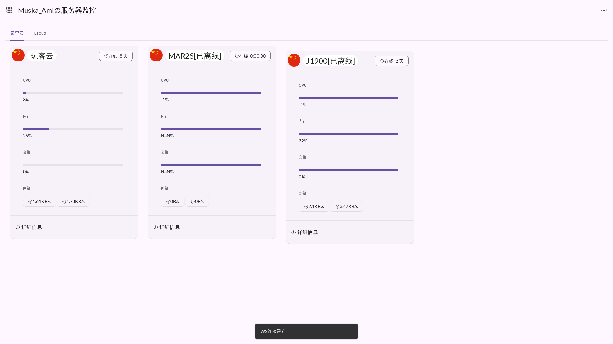

# 哪吒监控主题 Material+

基于新的 MDUI2 制作，使用Material Design 3设计，更美观。

仅支持 `dashboard v0.15.17` 及更新版本。

1. 克隆当前仓库到本地
2. 将 `theme-custom`(前台主题)、`static-custom`(前台主题静态文件) 和 `dashboard-custom`(后台主题) 放置到服务器上的 `/opt/nezha/dashboard/` 中
3. 将设置中 `前台主题` 设置为 `Custom(Local)` (目前只做了前台)
